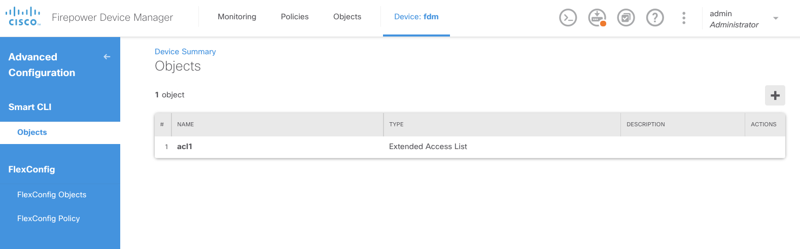
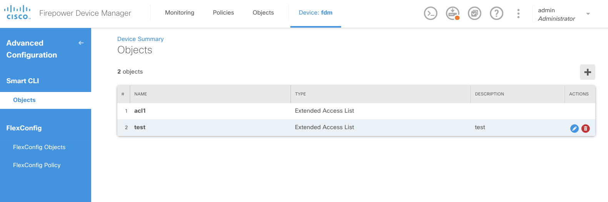
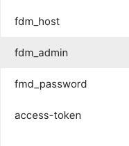

# FDM_Extended_ACL

This POSTMAN Collection shows the FDM Extended ACL example requests, like 
```
POST FDM Auth
GET ExtendedAccessList
POST ExtendedAccessList
```

Before the POSTMAN Collection run:



And after: 



Please create the necessary environment variables:


